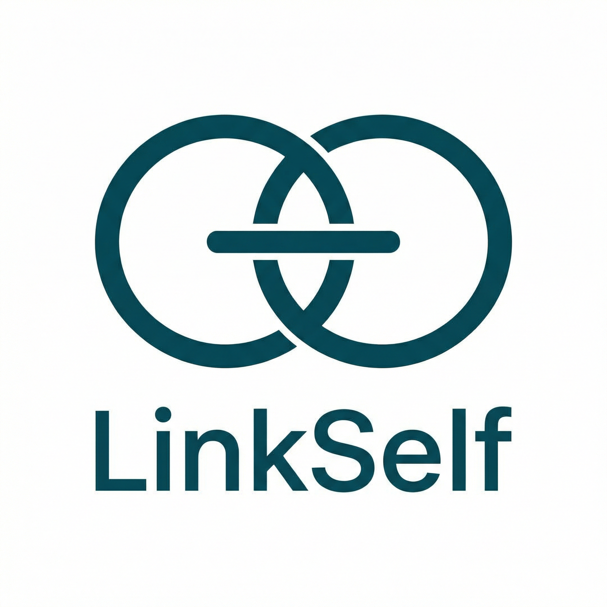

# LinkSelf

<p align="center"></p>

**A pure P2P infrastructure for the sovereign individual. No servers, just DID-based existence and direct links.**

主権ある個人のための純粋なP2Pインフラ。サーバーは不要。DIDによる実存の証明とダイレクトな繋がりを。

---

## Documentation | ドキュメント

**Detailed documentation (full text):**  
[English](docs/README.en.md) | [日本語](docs/README.ja.md)

---

## Overview | 概要

### What is LinkSelf? | LinkSelfとは？

LinkSelf is a **serverless P2P** stack: your identity (DID), your connections, and your data stay on your devices. Peers find each other via libp2p DHT; messages are end-to-end encrypted. No central server, no single point of control or censorship.

LinkSelfは**サーバー不要のP2P**スタックです。あなたのアイデンティティ（DID）、繋がり、データはあなたのデバイスにあります。ピアはlibp2p DHTで互いを見つけ、メッセージはエンドツーエンド暗号化。中央サーバーも、支配や検閲の拠点もありません。

### Why P2P? | なぜP2Pか？

Central servers are convenient (login, sync, always-on) but they **know everything about you**, hold your data, and can be compelled to hand it over. P2P gives you: **your data is yours**, **no one can delete your account**, **no single point of control**, **no censorship**, and **the network lasts as long as participants exist**.

中央サーバーは便利（ログイン、同期、常時接続）だが、**あなたのことをすべて知り**、データを握り、当局に渡す義務を負う。P2Pなら：**データはあなたのもの**、**アカウントを消されない**、**支配の拠点がない**、**検閲できない**、**参加者がいる限りネットワークは残る**。

### How it works (short) | 仕組み（要約）

1. **Identity** — You generate a DID (`did:key:...`) from a secret key on your device. Share it (QR, link). **アイデンティティ** — 端末で秘密鍵からDIDを生成。QRやリンクで共有。
2. **Contacts** — Others add your DID to their local “contacts.” No server. **連絡先** — 相手があなたのDIDをローカルの「連絡先」に追加。サーバー不要。
3. **Discovery** — When you run LinkSelf, you register “I am DID X at IP Y” in the libp2p DHT. Other nodes hold parts of this “phone book.” **発見** — LinkSelfを起動すると、libp2p DHTに「DID X、IP Y」を登録。他のノードが「電話帳」の一部を保持。
4. **Connection** — To talk to someone, you look up their DID in the DHT, get their IP, connect directly, and prove identity with a secret-key challenge–response. **接続** — 相手のDIDをDHTで検索し、IPを取得して直接接続。秘密鍵でチャレンジ・レスポンスして本人確認。
5. **Messages** — Store-and-forward: if the peer is offline, you keep the message locally and send when they come online. **メッセージ** — 相手がオフラインならローカルに保管し、オンラインになったら送信（Store-and-Forward）。
6. **Multiple devices** — Same secret key → same DID on phone, PC, tablet; they find each other (mDNS / DHT) and sync P2P. **複数デバイス** — 同じ秘密鍵で同じDID。mDNS／DHTで発見し、P2Pで同期。
7. **Groups** — Group metadata on the DHT; members add/remove by agreement. No single place to censor or delete. **グループ** — グループのメタデータはDHT上。メンバーで合意して追加・削除。一括削除する拠点はない。

### Technical stack | 技術スタック

- **DID (did:key)** — Self-sovereign ID; offline-capable, tamper-proof.  
  **DID（did:key）** — 自己主権ID。オフラインでも作成可能、改ざん不可。
- **libp2p DHT** — Distributed “phone book” for DID ↔ address; no central server (same idea as Bitcoin).  
  **libp2p DHT** — DIDとアドレスを分散の「電話帳」で管理。中央サーバーなし（Bitcoinと同じ考え方）。
- **Discovery** — DHT, mDNS (same Wi‑Fi), Bluetooth, relay, manual share (QR).  
  **発見** — DHT、mDNS（同一Wi‑Fi）、Bluetooth、リレー、手動共有（QR）。
- **Identity on connect** — Challenge–response with secret key; impersonation is rejected automatically.  
  **接続時の本人確認** — 秘密鍵でチャレンジ・レスポンス。なりすましは自動拒絶。
- **Cross-platform** — Go core usable as a library on each platform; UI chosen per platform (e.g. Electron, Flutter, native).  
  **クロスプラットフォーム** — Goコアを各プラットフォームでライブラリとして利用可能。UI はプラットフォームに合わせて選択（例: Electron, Flutter, ネイティブ）。
- **Local-first sync** — Store-and-forward when the peer is online.  
  **Local-first同期** — 相手がオンラインになったら送信（Store-and-Forward）。

---

## Open Source | オープンソース

This project is **open source** (Apache-2.0) and welcomes contributions.  
本プロジェクトは **オープンソース**（Apache-2.0）であり、貢献を歓迎します。

## Support / Donate | 寄付

We plan to register the project on **Gitcoin Grants** to accept donations. Your support helps sustain development.  
**Gitcoin Grants** でプロジェクトを登録し寄付を募る予定です。寄付で開発を支援できます。（URL は準備でき次第追記）

*For developers: [Gitcoin funding procedure](docs/gitcoin-funding.md) ([English](docs/gitcoin-funding.en.md)) — 開発者の備忘: [Gitcoin で資金調達するための手順](docs/gitcoin-funding.md)*

---

## Roadmap | ロードマップ

- [x] **Phase 1: Core logic** — Define and implement; run multiple nodes locally, cover various test cases. **Done.**  
  **Phase 1: コアロジック** — 定義・実装。ローカルで複数ノードを立ち上げ、様々なテストケースを網羅。**完了。**
- [ ] **Phase 2: Infrastructure** — Infrastructure module; one full-featured sample app (chat + P2P file sharing) that uses LinkSelf as infrastructure; path for using LinkSelf as a library.  
  **Phase 2: インフラモジュール** — インフラモジュール整備。LinkSelf をインフラとして使う 1 本の本格サンプルアプリ（チャット＋ファイル共有）。他アプリから LinkSelf をライブラリとして使う道筋の整備。
- [ ] **Phase 3: Platforms** — PC, Android, iOS.  
  **Phase 3: プラットフォーム** — PC、Android、iOS。
  - Mobile (iOS/Android) support design: [docs/spec/mobile-support.md](docs/spec/mobile-support.md)

---

## Getting Started | 開発の始め方

*This project is in early pre-alpha. / 本プロジェクトはプレアルファ段階です。*

```bash
git clone https://github.com/SeijiShii/link-self.git
cd link-self
go mod init github.com/SeijiShii/link-self
```

---

**Using LinkSelf as a library (platform-appropriate integration):**  
[English](docs/using-linkself-as-library.en.md) | [日本語](docs/using-linkself-as-library.md)

**Full documentation (philosophy, scenario, FAQ, security):**  
[English](docs/README.en.md) | [日本語](docs/README.ja.md)
