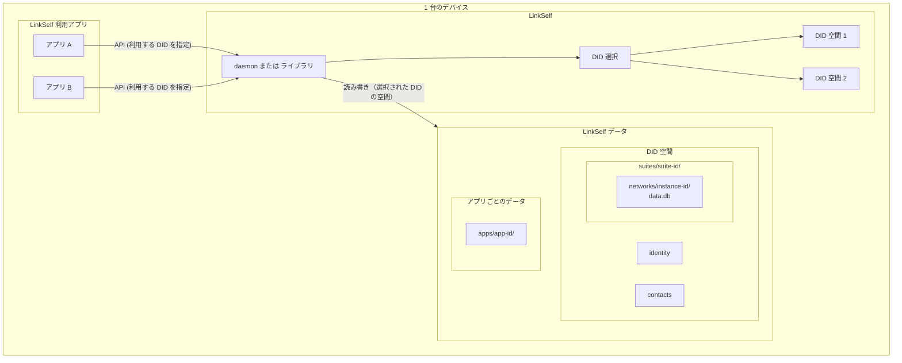

# LinkSelf 永続化と複数アプリ共有の Phase 2 方針

**概要:** LinkSelf ではユーザーが望む実存（DID）を選べる。デバイス上の保存構造は「LinkSelf データ > DID 空間 > アプリごとのデータ」とし、アプリデータはユーザーID（DID）ごとに分離する。チャットクライアントの複数インスタンス起動時も DID を選択して利用する。  
**参照:** [sync-db 計画](sync-db-plan.md)、[サンプルチャットアプリ計画](sample-chat-app-plan.md)、[Phase 1 設計](phase1-design.md)

---

## 1. 現状の永続化方式（参考）

チャットクライアントは **Electron の `app.getPath('userData')`** を基準に、**JSON ファイル** のみで永続化しています。データは**各アプリの userData** にあり、LinkSelf は使っていない。

| データ種別 | 保存先 | 形式 | 備考 |
|------------|--------|------|------|
| identity | `userData/identity.json` | JSON | daemon 起動時に `identityPath` として渡す |
| 連絡先（contacts） | `userData/contacts.json` | JSON 配列 | [main.ts](../chat-client/src/main.ts) の `readContacts` / `writeContacts` |
| 友達申請（friend-requests） | `userData/friend-requests.json` | JSON 配列 | `readFriendRequests` / `writeFriendRequests` |
| **チャットメッセージ** | **永続化なし** | — | React の `useState<Message[]>` のみ。タブ切り替え・再起動で消える |

- ユーザー分離は **`--user-data-dir=./data/userA`** などで `userData` を切り替えて実現（`dev:userA` / `electron:userB`）。
- メイン・プリロード・レンダラー間は IPC（`contacts:get` / `contacts:add` 等）で連携。

**daemon 側:** [core/cmd/linkself-daemon/main.go](../core/cmd/linkself-daemon/main.go) は `linkself.Client` の **SendMessage / Connect / SetOnMessage** のみ使用。**SyncLayer / sync-db は未使用**です。送信は内部で `node.SendToGroup`（2人グループ）で行われています。

---

## 2. 方針：ユーザーは実存を選べる、データは DID ごとに分離

- **LinkSelf ではユーザーは自分の望む実存（DID）を選べる**。複数の実存を保持し、利用時にどれを使うか選択できる。
- **アプリデータ内はユーザーID（DID）ごとに分離**する。アプリ層の仕様によるが、**保存されている実存の一覧から選んでライブラリを利用**できる。
- **チャットクライアントを複数インスタンスで立ち上げるときも、DID を選択**する（例: 起動時や設定で「どの DID で使うか」を選ぶ）。従来の userA/userB のような固定プロファイルではなく、**選択した DID に紐づくデータ**を読む。
- **デバイス内の保存構造**は **LinkSelf データ > DID 空間 > アプリごとのデータ** とする。

---

## 3. 保存構造：LinkSelf データ > DID 空間 > スイート / ネットワーク / アプリごとのデータ

> **注意（2026-04）:** Suite / Network の2層概念を導入。同期データ（MyDB / SharedDB）は Suite + ネットワークインスタンス単位で分離する。詳細は [データ同期コンセプト](../chat-client/docs/wants/data-sync-concept.md) を参照。

LinkSelf が管理するデータは、次の階層で配置する。Windows では AppData などプラットフォーム標準のユーザーデータディレクトリを LinkSelf データルートとする。

| 階層 | 説明 | 例（パス） |
|------|------|-------------|
| **LinkSelf データ** | デバイス上の LinkSelf ルート。環境変数で上書き可。 | `%LOCALAPPDATA%\LinkSelf`（Windows）など |
| **DID 空間** | 実存（DID）ごとのディレクトリ。1 実存＝1 ディレクトリ。 | `LinkSelf/<DID>/`（DID はファイル名安全な表現に変換） |
| **スイート** | アプリ群の識別（SuiteID）。同じスキーマ・ロール定義を共有するアプリ群。 | `LinkSelf/<DID>/suites/<suite-id>/` |
| **ネットワーク** | スイート内のメンバー集合とデータ空間。ユーザーが実行時に作成する。 | `LinkSelf/<DID>/suites/<suite-id>/networks/<instance-id>/` |
| **アプリごとのデータ** | アプリ固有の設定・キャッシュ。将来的拡張用。 | `LinkSelf/<DID>/apps/<app-id>/`（app-id は例: `com.example.chat-client`） |

**プラットフォーム別 LinkSelf データルート（案）:**

| プラットフォーム | LinkSelf データルート |
|------------------|----------------------|
| **Windows** | `%LOCALAPPDATA%\LinkSelf` または `%APPDATA%\LinkSelf` |
| **macOS** | `~/Library/Application Support/LinkSelf` |
| **Linux** | `~/.local/share/link-self` または `$XDG_DATA_HOME/link-self` |

- **DID 空間の下**に、LinkSelf が管理する **identity（鍵素材）、contacts、friend_requests** を置く。同一 DID を選んだアプリは同じ「つながり」を参照する。
- **スイート（`suites/<suite-id>/`）** の下に、そのスイートのネットワークインスタンスを配置する。SuiteID はアプリ開発者がハードコードする（逆ドメイン推奨）。
- **ネットワーク（`suites/<suite-id>/networks/<instance-id>/`）** の下に、同期データ（MyDB / SharedDB）を配置する。同じ SuiteID + インスタンス内の異なるアプリ（例: 編集アプリと閲覧アプリ）はデータを共有する。
- **アプリごとのデータ（`apps/<app-id>/`）** はアプリ固有の設定・キャッシュ用。同期データは Suite + ネットワークインスタンス単位のため AppID の役割は薄いが、将来的拡張のため概念として残す。

---

## 4. アーキテクチャ図

- **LinkSelf データ**: ルートの下に **DID 空間**（実存ごと）を並べ、その下に **identity、contacts** および **suites（スイート／ネットワーク単位のデータ）** と **apps（アプリごとのデータ）** を配置する。
- **複数アプリ・複数インスタンス**: アプリは利用する **DID を選択**し、その DID に紐づくデータだけを LinkSelf 経由で読み書きする。チャットクライアントを複数起動する場合も、起動時や設定で「DID を選ぶ」ことで、同じ DID を共有したり別 DID を使い分けたりできる。

---

## 5. データの役割分担（更新後）

いずれも **LinkSelf データ > 選択された DID 空間** の下に配置する。

| データ | 保存先（DID 空間内） | 管理者 | 役割 |
|--------|----------------------|--------|------|
| identity（鍵素材） | DID 空間直下（例: identity.json） | LinkSelf | その実存の識別子。daemon は「利用する DID」に応じてここから読む。 |
| contacts, friend_requests | 同上（例: user.db または JSON） | LinkSelf | 友だち登録・申請。その DID に紐づく。 |
| ネットワーク（メンバーシップ・ロール） | `suites/<suite-id>/networks/<instance-id>/` | LinkSelf | ネットワーク定義・メンバー・ロール割り当て。その DID に紐づく。 |
| アプリ定義テーブル（MyDB / SharedDB） | `suites/<suite-id>/networks/<instance-id>/data.db` | アプリが SQL クエリ経由でテーブル定義・CRUD。同期は LinkSelf が担当。 | アプリがテーブルを定義し SQL で操作。後勝ちで他端末と同期。 |
| アプリごとのデータ | DID 空間内 `apps/<app-id>/`（app-id は初期化時にアプリが渡す） | アプリ層 | その DID でそのアプリが使う設定・キャッシュ等。 |

- **チャットクライアント**は、contacts / friend_requests / ネットワーク情報を自前の userData には持たず、**利用する DID と SuiteID を指定して** LinkSelf の API（daemon の RPC）を呼ぶ。daemon は指定された DID の空間と、そのスイート内のネットワークデータを読み書きする。
- 複数インスタンス起動時は、**起動引数や UI で DID を選択**し、選んだ DID に紐づくデータでライブラリを利用する。

### 5.5 データ同期とストレージ

> **注意（2026-04）:** 詳細は [データ同期コンセプト](../chat-client/docs/wants/data-sync-concept.md) および [sync-db-plan.md](sync-db-plan.md) を参照。

LinkSelf はアプリから見た**ストレージそのもの**として機能する。アプリは SQL クエリを発行するだけで、同期・永続化・競合解決は LinkSelf が透過的に処理する。

- **MyDB（同一 DID 間）**: DID 空間内の全データを同一 DID の全デバイス間で透過的に同期する。アプリは同期を意識しない
- **SharedDB（異なる DID 間）**: ネットワークメンバー間で共有されるデータ。権限に基づいてアクセスが制御される
- **ストレージ**: データストア実装（SQLite3）は LinkSelf が完全に内包する。ストレージのパスは LinkSelf が DID 空間・SuiteID・ネットワークインスタンスに基づいて自動決定する。アプリはストレージの配置にも実装にも関与しない
- **Suite / Network**: 同期データは SuiteID + ネットワークインスタンス単位で分離。同じスイート内の異なるアプリはデータを共有する

---

> **注意（2026-04）:** 本セクション（§6）は旧用語（groups, sync-db, DeviceDB.Put 等）を含む。実装着手時に [データ同期コンセプト](../chat-client/docs/wants/data-sync-concept.md) に基づいて改訂予定。正となる設計は §3〜§5.5 および data-sync-concept を参照。

## 6. 実装に必要な作業（Phase 2 で想定）

### 6.0 Phase 2 の実装順序

- **推奨順序（A）**: **LinkSelf データルート／DID 空間の決定** → **つながり（contacts, friend_requests, groups）の LinkSelf 内包** → **sync-db クライアント（アプリ向け DB インターフェース）** の順で着手する。
- **別案（B）**: つながりの内包を先に進める場合は、既存 daemon を拡張して contacts／groups の RPC を追加し、そのあとでデータルート／DID 空間を整理する進め方もあり得る。計画では A を主順序とし、B は段階的に移行する場合の選択肢として記述する。

### 6.1 LinkSelf データルートと DID 空間の決定

- **コアまたは daemon** で「LinkSelf データルート」を返す／受け取る仕様にする。
  - デフォルト: 上記のプラットフォーム別パス（Windows: AppData、macOS: Application Support、Linux: XDG）。
  - オプション: 環境変数や起動引数で `LINKSELF_DATA_DIR` を指定可能にする。
- **DID 空間**: データルートの下に `<DID>` ごとのディレクトリを用意する。DID はファイルシステムで安全な形（例: ハッシュやエンコード）に変換してディレクトリ名にする。
- daemon の `start` では **利用する DID**（または既存の `identityPath`）と **アプリID** を受け取り、**その DID の空間**および **その DID 空間内の `apps/<app-id>/`** を今回のセッションで使う。アプリID は sync-db やアプリごとのデータにアクセスする際の名前空間として使う。省略時は「既定 DID」や「一覧の先頭」などアプリ層の仕様に合わせる。

### 6.2 友だち・グループを LinkSelf に内包（DID 空間内）

- **保存先**: 選択された **DID 空間内**。例: `user.db`（SQLite3）に `contacts` / `friend_requests` / `groups` テーブル。
- **実装場所**: core 内（例: `core/internal/userstore` または既存の group 拡張）。daemon は「今回のセッションで使う DID」に応じてその DID 空間のストアを開き、RPC で getContacts / addContact / getFriendRequests / getGroups / createGroup 等を提供。
- **チャットクライアント**: 起動時または設定で **DID を選択**し、contacts / friend_requests の取得・更新は **その DID を指定した daemon の RPC** に切り替える。自前の JSON 読み書きは廃止。

### 6.3 チャット内容を DeviceSync + GroupShare で扱う（DID 空間内）

- **DeviceSync**: contacts / friend_requests / メッセージ履歴は `DeviceDB.Put` で DID 空間内に保存。同一 DID の全デバイスに自動複製される。
- **GroupShare**: チャットメッセージの送信は `GroupShare.Put("chat", msgID, body)` で Channel 経由。グループメンバーに AccessPolicy に沿って配信される。
- **受信側**: GroupShare の `SetOnSharedData` で受信 → ローカルの DeviceDB にも保存（履歴の全デバイス同期）。
- チャットクライアントは、メッセージ一覧の取得を **DeviceDB 経由の RPC**（ローカルから読み取り）、送信を **GroupShare 経由の RPC** に切り替える。

### 6.4 複数インスタンス・複数アプリと DID 選択

- **チャットクライアントを複数インスタンスで立ち上げる場合**: 各インスタンスで **DID を選択**する（起動引数・設定画面・起動時ダイアログなど）。選択した DID に紐づく LinkSelf データ（contacts、groups、sync.db）だけが使われる。
- **複数アプリ**: 同じ LinkSelf データルートを参照し、各アプリが「利用する DID」と **アプリID**（初期化時に渡す）を指定する。同じ DID を選べば、その DID のつながりをどのアプリからも利用できる。**アプリごとのデータ**は `LinkSelf/<DID>/apps/<app-id>/` のように DID 空間の下にアプリID で分離する。アプリID は衝突を避けるため、逆ドメインなどアプリ側で一意なものを渡す。
- 保存されている実存の一覧（利用可能な DID のリスト）を返す API を LinkSelf が提供し、アプリ層で「どれを使うか」を選べるようにする。

---

## 7. 依存・注意点

- **DeviceStorage / SharedStorage の SQLite 実装**: [sync-db 計画](sync-db-plan.md) に基づき、DeviceSync 用の DeviceStorage と GroupShare 用の SharedStorage の SQLite 実装を追加する。
- **DID のディレクトリ名**: DID 文字列はファイルシステムで安全な形（例: SHA256 の先頭バイトを hex、または base64url エンコード）に変換して DID 空間のディレクトリ名にする必要がある。
- **アプリID**: アプリごとのフォルダ名として使うアプリID は、**LinkSelf を利用するアプリがインスタンス初期化時（sync-db 等にアクセスするとき）に渡す**。LinkSelf は中央で ID を発行しない。アプリは Android のパッケージ名のように衝突しない一意な ID（例: 逆ドメイン `com.example.chat-client`）を選ぶ責任を持つ。アプリID をファイルシステムで安全なディレクトリ名に変換する必要がある場合は、DID と同様にエンコードする。
- **保存されている実存の一覧**: LinkSelf が「利用可能な DID のリスト」を返す API を提供し、アプリ層で起動時や設定画面で DID を選択できるようにする。
- **新規 DID 作成**: 新規 DID（新規実存）を作成する API／フローを Phase 2 で検討する。利用可能な DID 一覧に加え、ユーザーが新しい実存を追加する操作を LinkSelf が提供する。
- **同一 DID 空間への複数プロセス**: 複数アプリの daemon が同一 DID 空間のファイルに同時アクセスする場合の方針（SQLite の WAL モードや単一 daemon 共有など）を Phase 2 で検討する。
- **一覧取得**: DeviceStorage.List / SharedStorage.ListByChannel で一覧取得をサポート済み。
- **Windows AppData**: 実際のパスは `process.env.LOCALAPPDATA`（Node）や Go の `os.UserConfigDir` 等で取得する。インストーラやドキュメントで「LinkSelf のデータは AppData に保存されます」と明記するとよい。
