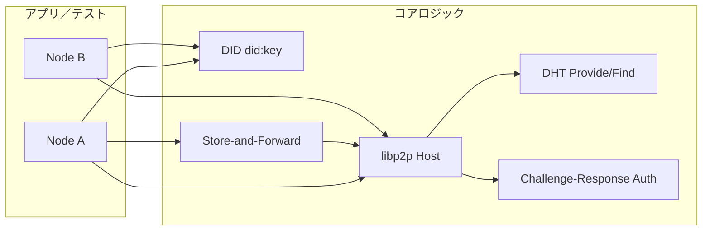

# Phase 1: コアロジック — 設計・実装方針

**日本語**（このページ）| [English](phase1-design.en.md)  
**ステータス:** 実装済み（ローカル多ノードテスト含む）  
**参照:** [Roadmap（ロードマップ）](README.ja.md#roadmap)、[core/README.md](../core/README.md)

---

## 1. Phase 1 のスコープ

ドキュメント「シナリオ：田中さんとトモダチ」および Technical Approach に基づき、Phase 1 で実装したコアは以下です。

| 機能 | 内容 |
|------|------|
| **DID** | 端末で秘密鍵から `did:key` を生成・共有。秘密鍵は端末外に出さない。 |
| **連絡先** | 相手の DID をローカルに登録（Phase 1 では「保存」のみ）。 |
| **起動・DHT 登録** | ノード起動時に libp2p DHT へ「DID ↔ 自分のアドレス」を提供。 |
| **発見** | 相手の DID で DHT を検索し、アドレス（PeerID / Multiaddr）を取得。 |
| **接続・本人確認** | 取得したアドレスに接続し、秘密鍵によるチャレンジ・レスポンスで認証。なりすましは拒絶。 |
| **メッセージ** | Store-and-Forward。グループ単位で送信（自分を除く各メンバー DID に配信）。相手オフライン時はローカルに保持し、オンライン検知後に送信。 |
| **グループ** | メンバー DID の集合（2 人以上）。1 対 1 は 2 人グループのケース。メンバーリストは各ノードがローカルに保持。詳細は [グループの概念](group-concept.md) を参照。 |

注: 送信・接続 API はグループ汎用（SendToGroup / ConnectToGroup）への移行を計画している。現状実装は 1 対 1（SendMessage / Connect）のまま。

---

## 2. 全体アーキテクチャ（コア部分）



- **DID**: 秘密鍵 ↔ `did:key` の生成・検証。Ed25519 で libp2p PeerID と相互変換可能。
- **Host + DHT**: 1 ノード = 1 libp2p Host。DHT で「DID に紐づくキー → PeerInfo」の Provide/Find。
- **Auth**: ストリーム確立後にチャレンジを送り、相手が秘密鍵で署名したレスポンスを検証。成功時のみ認証済みピアとして扱う。
- **Store-and-Forward**: 送信先がオフラインならローカルキューに保存。認証済みピア接続時または Connect 成功時にキューを送信。

---

## 3. リポジトリ構成（実装済み）

基本モジュールはルート直下ではなく **`core/`** にまとめています。ルートにはドキュメント・README・LICENSE を置き、Go コードは `core/` 以下に集約しています。

```
link-self/
├── README.md
├── LICENSE
├── docs/
│   ├── README.ja.md
│   ├── README.en.md
│   └── phase1-design.md    # 本ドキュメント
└── core/                    # 基本モジュール（Go）。PC / Android / iOS で共有するコア
    ├── go.mod               # module github.com/SeijiShii/link-self/core
    ├── README.md
    ├── internal/
    │   ├── did/             # did:key 生成・パース・検証
    │   ├── dht/             # DHT の Provide/Find のラップ（DID ↔ AddrInfo）
    │   ├── auth/            # チャレンジ・レスポンス認証
    │   ├── node/            # ノード = Host + DHT + Auth + Store の組み立て
    │   └── storeforward/   # メッセージキューとオンライン検知時の送信
    ├── pkg/                 # 必要なら外部公開用（Phase 1 では未使用）
    ├── cmd/linkself/        # サンプルアプリ用エントリ（チャット＋ファイル共有、未実装）
    └── test/integration/    # ローカル多ノード統合テスト
```

- `go.mod` は **core/** 直下のみ。モジュールパスは `github.com/SeijiShii/link-self/core`。
- Phase 2 以降で各プラットフォームのアプリ（Flutter、Electron、ネイティブなど）や他リポジトリから参照する場合は、この `core` モジュールを import（gomobile / FFI / subprocess で利用する際も `core/` をビルド対象にする）。

---

## 4. パッケージ役割と設計上の依存関係

実装は次の順序で依存関係を満たしています。

1. **基盤（did）**  
   秘密鍵生成、`did:key` の生成・パース（Ed25519）。libp2p の鍵型と合わせ、PeerID と DID の相互変換を可能にした。

2. **DHT（dht）**  
   libp2p Host と Kademlia DHT を組み立て。DID に紐づくキーで PutValue/GetValue により PeerInfo を Provide/Find。キー設計は「DID 文字列の SHA256 を base32 エンコード」で安定化。

3. **認証（auth）**  
   ストリーム確立後、送信側がランダムチャレンジを送り、受信側が秘密鍵で署名して返す。送信側が DID/公開鍵で検証。失敗時はストリームを閉じる。

4. **ノード（node）**  
   Host + DHT + Auth を組み立て、接続はグループ単位（ConnectToGroup）を想定。現状は `Connect(did)` で「DID で検索 → 接続 → 認証」までを実行。Store-and-Forward のフラッシュトリガー（Connect 成功時・着信 auth 完了時）でキューを送信。

5. **Store-and-Forward（storeforward）**  
   送信先 DID ごとにメッセージをメモリで保持。認証済みピア接続時または Connect 成功時に、その DID に紐づくキューを送信。送信失敗時は未送分を再キュー。

---

## 5. DID ↔ DHT キー・メッセージ形式（仕様）

- **DID**: `did:key:` + multibase(base58btc, multicodec(0xed) + raw Ed25519 公開鍵 32 バイト)。
- **DHT**: 常に公開 DHT（`ProtocolPrefix("/ipfs")`）を使用。PutDID/FindDID は使わず、FindPeer(DIDToPeerID(did)) で相手を検索。
- **メッセージプロトコル**: `/linkself/msg/1.0.0`。ペイロードは 4 バイト BigEndian 長 + 本体。

---

## 6. 依存関係（実装で使用）

- **libp2p**: `github.com/libp2p/go-libp2p`, `github.com/libp2p/go-libp2p-kad-dht`
- **DID / 鍵**: libp2p の `core/crypto`（Ed25519）、`github.com/multiformats/go-multibase`
- **DHT レコード**: `github.com/libp2p/go-libp2p-record`
- **テスト**: 標準 `testing`（`test/integration` で統合テスト）

---

## 7. Phase 1 の成果物と完了基準（達成済み）

- **コアロジックの定義**: 上記パッケージ構成と DID↔DHT キー・メッセージ形式を [core/README.md](../core/README.md) および本ドキュメントに明文化。
- **実装**: `core/internal/did`, `core/internal/dht`, `core/internal/auth`, `core/internal/node`, `core/internal/storeforward` が上記スコープを満たす。
- **ローカル多ノードテスト**: 同一プロセス・ローカルホストで 5 シナリオを網羅するテストが `go test ./test/integration/...` で通る。

### 5 シナリオ（テストでカバー）

1. **DID 生成・一致**: 同一秘密鍵から同じ DID が得られること。
2. **DHT 登録・発見**: Node A が起動して Provide → Node B が Find で A のアドレスを取得できること。
3. **接続・認証**: B が A の DID で接続し、チャレンジ・レスポンスで認証成功すること。
4. **メッセージ（オンライン）**: A と B がともにオンラインのとき、B→A のメッセージが A に届くこと。
5. **メッセージ（Store-and-Forward）**: B が A にメッセージを送るがその時点で A はオフライン → B がキューに保持 → A が起動し B が Connect でフラッシュ → A が受信すること。

---

## 8. Phase 2 以降との関係

Phase 2（インフラモジュール・サンプルアプリ）は、本 Phase 1 で実装した `core` モジュール（`core/internal` の API）を呼び出す形で拡張する想定です。ルートの [README.md](../README.md) の Getting Started は、`cd link-self/core` で `go mod tidy` 等を実行する旨に Phase 2 で更新する想定です。

## 9. 関連ドキュメント

- [グループの概念](group-concept.md): グループ・オーナー・脱退・権限の扱い。
- [分散ネットワーク DB 化計画](sync-db-plan.md): アプリからネットワークを DB として扱う設計。
- [サンプルチャットアプリ計画](../app/sample-chat-app-plan.md): グループ API を用いたサンプルアプリの設計。
