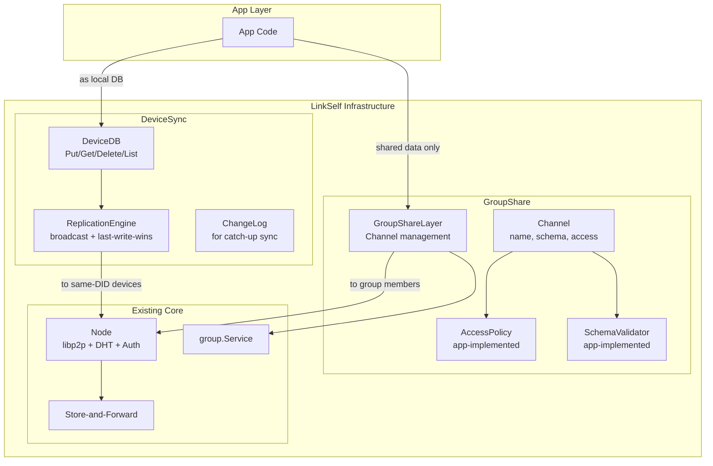

# Data Sync Design: DeviceSync / GroupShare Two-Layer Architecture

**English** (this page) | [日本語](sync-db-plan.md)
**Status:** DeviceSync / GroupShare core implemented (in-memory storage and tests complete; SQLite reference implementation not yet done)
**See also:** [Phase 1 design](phase1-design.en.md), [Group concept](network-concept.en.md), [Persistence plan](linkself-data-persistence-plan.md)

---

## 1. Background and Direction Change

### 1.1 Role as a Sync Transport Layer

**DeviceDB / GroupShare is a "sync transport layer", not an application's general-purpose DB.** LinkSelf's storage (`device_records`, `shared_records`, `change_log`) exists to provide data synchronization between devices and users.

- **Provides:** Logical namespaces (`table`, `channel`), record-level CRUD, automatic last-write-wins conflict resolution, ChangeLog-based incremental sync
- **Does not provide:** Queries by fields within `body`, cross-table JOINs, app-specific schema constraints or indexes

When an app needs rich queries (WHERE clauses, JOINs, full-text search, etc.), the recommended architecture is to mirror LinkSelf's sync data into the app's own DB and run queries there. LinkSelf handles the sync responsibility; the app handles the query responsibility.

```
App layer:      App's own DB ← rich queries (WHERE, JOIN, INDEX)
                   ↑ mirror received data
LinkSelf layer: DeviceDB / GroupShare ← sync transport (table + id + body)
```

### 1.2 From Old Design

The old design (single SyncLayer) broadcast records uniformly to all group members. However, data sharing between "your own devices" and "other users in a group" are fundamentally different semantics.

- **Between own devices (same DID):** Should sync all data transparently, like a local DB
- **Between group members (different DIDs):** Should work like a server-side API — only app-defined shared data flows, following app-defined permissions

This led to deprecating the old `syncdb` package and replacing it with **`devicesync`** + **`groupshare`**.

---

## 2. Conceptual Model

### 2.1 DeviceSync (same DID, multiple devices)

```
App → DeviceDB.Put("contacts", id, body)
        ↓ automatically
     ChangeLog entry → broadcast to all devices with same DID
        ↓ receiver
     last-write-wins apply (app is unaware of sync)
```

| Aspect | Details |
|--------|---------|
| **Target** | Multiple devices sharing the same private key (= same DID) |
| **Scope** | All data written by the app (all tables, all records) |
| **Sync method** | Broadcast on write + catch-up sync on connect (ChangeLog-based) |
| **Conflict resolution** | Last-write-wins (timestamp) |
| **Groups** | Not used. Same DID devices don't need group.Group |
| **Peer discovery** | DHT (same PeerID, multiple addresses) + mDNS (LAN) |

### 2.2 GroupShare (different DIDs)

```
App → Define Channel (name, schema, access policy)
    → GroupShare.Put(channel, id, body)
        ↓ AccessPolicy.CanWrite(did) check
     SharedRecord created → broadcast to group members
        ↓ receiver
     SchemaValidator.Validate() + AccessPolicy.CanRead(did) → apply or reject
```

| Aspect | Details |
|--------|---------|
| **Target** | Different DIDs within a group |
| **Scope** | Only data explicitly defined as a Channel by the app |
| **Permissions** | LinkSelf provides `AccessPolicy` / `SchemaValidator` interfaces; app implements them |
| **Sync method** | Broadcast on Put via Channel + last-write-wins |
| **Groups** | Reuses existing `group.Group` / `group.Service` as-is |

---

## 3. Architecture



---

## 4. DeviceSync Package (core/internal/devicesync)

### 4.1 Types

```go
type ChangeEntry struct {
    Seq       uint64 // monotonically increasing sequence per device
    Timestamp int64  // milliseconds
    Table     string // logical table (namespace)
    RecordID  string // unique key within table
    Op        Op     // Put | Delete
    Body      []byte // payload (Put only)
}

type Record struct {
    ID, Table string
    Body      []byte
    Timestamp int64
}
```

### 4.2 DeviceStorage Interface

```go
type DeviceStorage interface {
    Put(ctx, table, id string, body []byte, timestamp int64) (seq uint64, err error)
    Get(ctx, table, id string) (*Record, error)
    Delete(ctx, table, id string, timestamp int64) (seq uint64, err error)
    List(ctx, table string) ([]*Record, error)
    GetTimestamp(ctx, table, id string) (int64, error)
    AppendChange(ctx, entry *ChangeEntry) error
    ChangesSince(ctx, since uint64) ([]*ChangeEntry, error)
    LatestSeq(ctx) (uint64, error)
}
```

### 4.3 ReplicationEngine

- **Put(table, id, body):** Store locally → broadcast ChangeEntry as JSON to all peer devices
- **Delete(table, id):** Delete locally → broadcast ChangeEntry (OpDelete)
- **Get / List:** Read directly from local storage (no network)
- **HandleIncoming(entry):** Apply with last-write-wins (timestamp comparison). Skip older changes.

### 4.4 Test Coverage: **18 tests, 91.1%**

---

## 5. GroupShare Package (core/internal/groupshare)

### 5.1 Types

```go
type Channel struct {
    Name    string
    GroupID string
    Schema  SchemaValidator // nil = accept any body
    Access  AccessPolicy    // nil = allow all
}

type SchemaValidator interface { Validate(body []byte) error }
type AccessPolicy interface { CanWrite(did string) bool; CanRead(did string) bool }

type SharedRecord struct {
    ID, Channel, GroupID, DID string
    Timestamp                 int64
    Body                      []byte
    Deleted                   bool
}
```

### 5.2 SharedStorage Interface

```go
type SharedStorage interface {
    PutShared(ctx, record *SharedRecord) error
    GetShared(ctx, channel, id string) (*SharedRecord, error)
    GetTimestamp(ctx, channel, id string) (int64, error)
    DeleteShared(ctx, channel, id string) error
    ListByChannel(ctx, channel string) ([]*SharedRecord, error)
}
```

### 5.3 GroupShareLayer

- **RegisterChannel(ch):** Register a channel. Duplicate returns `ErrChannelExists`
- **Put(channel, id, body):** Check AccessPolicy.CanWrite → attach meta → store → broadcast to group members
- **Delete(channel, id):** Delete from storage → broadcast SharedRecord with Deleted=true
- **HandleIncoming(payload):** JSON decode → CanRead check → Schema validate → last-write-wins apply

### 5.4 Test Coverage: **17 tests, 88.5%**

---

## 6. Migration from Old syncdb

| Old syncdb | New package | Notes |
|------------|-------------|-------|
| `SyncLayer` | `devicesync.ReplicationEngine` + `groupshare.GroupShareLayer` | Split into two |
| `SyncRecord` | `devicesync.ChangeEntry` + `groupshare.SharedRecord` | Separated by purpose |
| `RecordStorage` | `devicesync.DeviceStorage` + `groupshare.SharedStorage` | Added List etc. |
| `MemStorage` | `devicesync.MemStorage` + `groupshare.MemSharedStorage` | Dedicated per package |
| `GroupStoreResolver` | `groupshare.MemberResolver` | Redefined in GroupShare |

Old `core/internal/syncdb` to be removed in Phase E.

---

## 7. Upcoming Implementation

1. **Public API extension** (`pkg/linkself`): Add `DeviceDB()` / `GroupShare()` / `Groups()` to `Client`
2. **Node protocol separation:** `/linkself/devicesync/1.0.0`, `/linkself/groupshare/1.0.0`
3. **daemon JSON-RPC extension:** `devicedb.*`, `groupshare.*`, `groups.*` methods
4. **SQLite reference implementation:** For DeviceStorage / SharedStorage
5. **Catch-up sync handshake:** DeviceSync SyncWith (exchange high-water marks → send missing entries)

---

## 8. Notes

- **Timestamp:** Wall-clock milliseconds for last-write-wins. Extensible to logical time (Lamport) if NTP skew becomes an issue
- **Permissions:** GroupShare AccessPolicy / SchemaValidator are implemented by the app layer. LinkSelf provides only abstract interfaces
- **Groups:** group package unchanged. Only GroupShare uses it. DeviceSync does not use the group concept
- **Storage:** All interface-based. The storage backend is selected via `Config.StorageConfig` (`SQLiteBackend(path)` or `MemoryBackend()`). Individual interface injection from outside is not supported (these are internal details of the sync transport). Apps that need rich queries should use their own DB alongside LinkSelf
