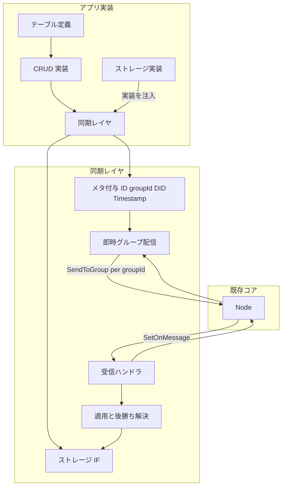

# 分散型ネットワークを DB として扱う設計計画

**日本語**（このページ）| [English](sync-db-plan.en.md)  
**ステータス:** コア実装済み（同期レイヤ・ストレージ IF・インメモリ実装。SQLite 参照実装は未着手）  
**参照:** [Phase 1 設計](phase1-design.md)、[グループの概念](group-concept.md)、[グループ・同期 DB 実装ドキュメント](group-syncdb-implementation.md)

---

## 1. 目標

- アプリからは「分散ネットワーク = DB」として扱う。
- **汎用性を持たせるため、SQLite3 をラップした同期レイヤ**とする。**ストレージ部はインターフェース化**し、実装はアプリ側に委ねる。同期レイヤは「メタ付与・即時配信・後勝ち適用」のみを担当する。
- **アプリ実装者**は (1) ストレージの実装（例: SQLite を用いた参照実装）を選択または自前実装し、(2) テーブル定義と CRUD をそのストレージに対して行う。同期用のメタ情報は同期レイヤが付与・管理する。
- ユースケース: あるアプリをインストールしたユーザー群（グループ）が、Figma のようにドキュメントを編集し、データはアプリが選んだストレージ（例: SQLite）に保存され、同期レイヤがネットワークへ共有する。
- **各レコードに ID, groupId, DID, Timestamp などのメタ情報が付与され、即時にネットワーク上のデバイスに共有**される。
- 編集コンフリクトは **後勝ち（last-write-wins）** とする。
- **編集・閲覧権限**の切り分けはアプリ側のレイヤーで行う（[グループの概念](group-concept.md) 参照）。コアのグループはメンバー・オーナーのライフサイクルのみを扱う。

---

## 2. 現状の前提

- [core/internal/node](core/internal/node/node.go): 送信は 1 対 1（SendMessage）およびグループ（SendToGroup 実装済み）。グループは [グループの概念](group-concept.md) に従い、メンバー DID のリストとして扱う。
- [core/internal/storeforward](core/internal/storeforward/storeforward.go): オフライン時はキューに保存し、オンライン検知後に送信。
- グループ = **メンバー DID のリスト**。groupId に紐づく DID リストは [core/internal/group](core/internal/group) の Store で保持し、同期レイヤは MemberResolver（group.Store ラップ）で取得する（[グループの概念](group-concept.md) 参照）。

---

## 3. アーキテクチャ概要

- **アプリ実装者**は **ストレージの実装**（例: SQLite を用いた参照実装、または自前の永続化）を用意し、同期レイヤに注入する。テーブル定義と CRUD はそのストレージに対して行う。
- **同期レイヤ**は **ストレージをインターフェース** として扱う。書き込み時に **各レコードに ID, groupId, DID, Timestamp などのメタ情報を付与**し、**即時に**その groupId に属するメンバーへ **SendToGroup** で共有する。受信時は同一レコード（同じ ID または table+pk）について **タイムスタンプが新しい方** のみストレージに適用する（後勝ち）。

---

## 4. 設計の要点

### 4.1 配置と依存

- **新パッケージ**: `core/pkg/syncdb`（または `core/internal/syncdb`）。同期レイヤ（メタ付与・即時配信・後勝ち適用）を提供。アプリと `node` の間に置く。
- **依存**: 既存 node の **SendToGroup**（計画）／**SetOnMessage** を利用。**ストレージはインターフェース**として受け取り、実装はアプリが注入する。グループは [グループの概念](group-concept.md) に従い、**groupId に紐づくメンバー DID のリスト** として同期レイヤまたはアプリが保持する。

### 4.2 ストレージのインターフェース化

- **ストレージ部をインターフェース化**し、実装をアプリ側に委ねる。同期レイヤは「レコードの読み書き」「メタ（Timestamp 等）の取得・比較」に必要な最小限の操作だけをインターフェースで要求する。
- **メリット**:
  - **柔軟性**: アプリは SQLite の参照実装を使うことも、自前の永続化（別 DB・キーバリュー・ファイル）を渡すこともできる。
  - **テスト容易性**: テスト時はインメモリ実装やモックを注入すれば、ネットワークや永続化に依存しない単体テストが可能。
  - **責務の分離**: 同期レイヤは「メタ付与・配信・後勝ち適用」に専念し、永続化の詳細（SQLite かどうか、暗号化の有無など）はアプリに任せられる。
- **インターフェースの契約（案）**: レコードの Put / Get / Delete、および同一キーに対する既存レコードの Timestamp 取得ができればよい。テーブル＋主キー、またはレコード ID をキーとする形で定義する。
- **参照実装**: SQLite を用いたストレージ実装を同梱または別パッケージで提供する。アプリはそれをそのまま使うか、ラップして暗号化・圧縮などを追加できる。アプリが「SQLite のテーブル定義と CRUD をそのまま書きたい」場合は、この参照実装を注入すればよい。

### 4.3 拡張 SQLite ラッパの形態（参照実装として）

- アプリが **SQLite をそのまま使いたい** 場合は、**ストレージの参照実装として「SQLite をラップしたストレージ」** を用意する。アプリはその参照実装を同期レイヤに渡し、テーブル定義と CRUD は従来どおり SQLite に対して行う。
- **実現方法**: (A) 標準 SQLite ドライバをラップし、**update hook / commit hook** で INSERT/UPDATE/DELETE を検出して同期レイヤに通知し、メタ付与・即時配信する。(B) 同期対象テーブルに **メタ列（id, group_id, did, timestamp）を必須とするスキーマ規約** を定め、参照実装がそれらを DEFAULT またはトリガで埋め、コミット時に変更行を同期レイヤに渡す。
- **制約**: 同期対象のテーブルは **主キーが定義されている** ことを前提とする（コンフリクト単位のため）。

### 4.4 各レコードのメタ情報と即時共有

| メタ項目 | 内容 |
|----------|------|
| **ID** | レコード一意（例: UUID）。同一レコードの競合判定に使用。 |
| **groupId** | どのグループに属するか。配信先（そのグループのメンバー DID 一覧）の決定に使用。 |
| **DID** | そのレコードを書いたユーザー（ノード）の DID。 |
| **Timestamp** | 更新時刻（ミリ秒）。後勝ち比較に使用。 |

- 書き込みがコミットされると、**変更されたレコード**（行）を上記メタ付きでシリアライズし、**即時に** その groupId に属するメンバー（DID リスト）へ **SendToGroup** で配信する。
- ペイロード形式: レコード内容 + メタ（id, groupId, DID, Timestamp）を JSON などで符号化。受信側は同じスキーマのテーブルに **Timestamp による後勝ち** で適用する。

### 4.5 グループ配信（即時共有）

- コアの送信 API は **SendToGroup(ctx, memberDIDs, payload)** を想定。**groupId に紐づくメンバー DID のリスト** を拡張側が保持し、レコードのコミット時に **その groupId に属する各 DID に対して即時配信**する。
- オフラインの相手は既存の **Store-and-Forward** により、オンラインになったタイミングで届く。

### 4.6 受信・適用と後勝ち

- **SetOnMessage** に登録するコールバックで、受信バイト列を「レコード + メタ（ID, groupId, DID, Timestamp）」としてデコード。
- **適用**: **ストレージインターフェース** 経由で、レコード内容に従い Put / Delete を呼ぶ。ストレージの実装（SQLite 参照実装など）が実際の INSERT/UPDATE/DELETE を行う。
- **後勝ち**: 同じ **レコード ID**（または table + primary_key）に対して、ストレージから既存の Timestamp を取得し、**受信レコードの Timestamp が既存より大きい場合のみ** 適用。同じまたは古い場合はスキップ。
- 初回適用時やメタが無い場合は「適用する」でよい。

### 4.7 スキーマ・メタデータ

- 同期対象テーブルに **主キー必須** をドキュメントで明示。
- **メタ列**: アプリは同期対象テーブルに **ID, groupId, DID, Timestamp** などのメタ列を定義する（規約名例: `_sync_id`, `_group_id`, `_did`, `_timestamp`）。拡張ドライバが INSERT/UPDATE 時に未指定分を補完し、即時共有に使用する。

---

## 5. 注意点・他計画との整合

- **グループの発見**: 誰がグループに属するかは [グループの概念](group-concept.md) に従い、メンバーリストは各ノードがローカルに保持する。**メンバー DID リストはアプリが用意し、SyncDB に渡す**形になる（招待フローはアプリまたは別フェーズで定義）。
- **権限**: ドキュメントの編集・閲覧権限の切り分けは**アプリ側のレイヤー**で行う。コアのグループ概念はメンバー・オーナーのライフサイクルのみを扱う。
- **順序**: メッセージ到着順と実時間順は一致しないため、**後勝ちは必ず timestamp で比較**し、到着順で上書きしない。
- **タイムスタンプ**: 実装では NTP ずれを考慮するなら論理時刻（Lamport など）も選択肢。まずは実時刻（ミリ秒）で後勝ちを実装し、必要なら拡張可能にしておく。

---

## 6. まとめ

- **同期レイヤ**を node の上に追加する。**ストレージ部はインターフェース化**し、実装はアプリに委ねる。アプリは SQLite の参照実装を注入するか、自前の永続化を渡す。
- 同期レイヤは **メタ付与・即時配信・後勝ち適用** のみを担当する。各レコードに ID, groupId, DID, Timestamp を付与し、コミット時に **即時に** ネットワーク上のデバイス（その groupId に属するメンバー DID）へ SendToGroup で共有する。
- 受信側では **レコード単位で Timestamp 比較** し、**後勝ち** でストレージインターフェース経由で適用する。
- グループは [グループの概念](group-concept.md) に従い、**groupId に紐づくメンバー DID のリスト** として同期レイヤまたはアプリが保持する。

---

## 7. 実装とテスト

- **実装**: [core/internal/syncdb](../core/internal/syncdb)。`RecordStorage` インターフェースとインメモリ実装（`NewMemStorage`）、`MemberResolver`（`GroupStoreResolver` で group.Store をラップ、自 DID 除外）、`SyncLayer`（`Put` / `HandleIncoming`）。node に `SendToGroup` を追加済み。ペイロードは `SyncRecord` の JSON。
- **テスト**: 単体（`sync_test.go`: メタ付与・保存・SendToGroup 呼び出し、後勝ち適用・古いタイムスタンプスキップ・Deleted 時の Delete）、統合（`test/integration/syncdb_test.go`: 2 ノード + 1 グループで A が Put → B が受信してストレージに反映）。
- **詳細**: [グループ・同期 DB 実装ドキュメント](group-syncdb-implementation.md) の「2. ノードの SendToGroup」「3. 同期 DB」「4. 統合テスト」を参照。
