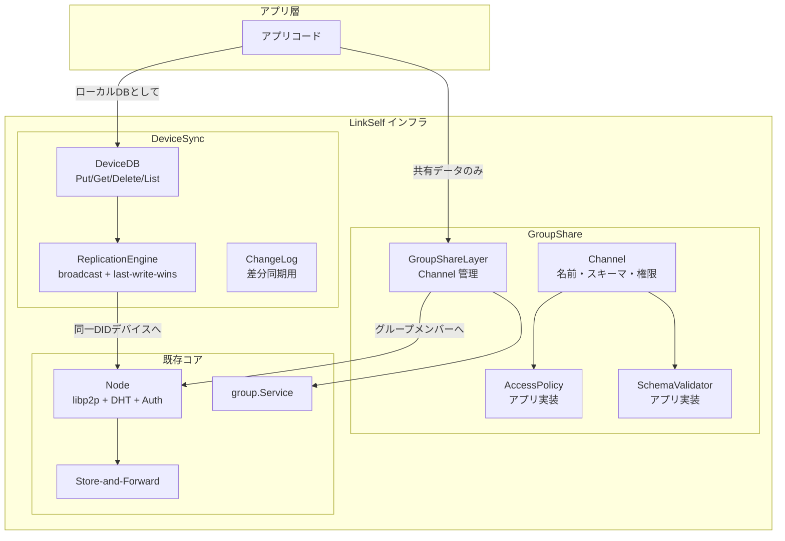

# データ同期設計: DeviceSync / GroupShare 二層アーキテクチャ

**日本語**（このページ）| [English](sync-db-plan.en.md)
**ステータス:** DeviceSync / GroupShare コア実装済み（インメモリストレージ・テスト完了。SQLite 参照実装は未着手）
**参照:** [Phase 1 設計](phase1-design.md)、[グループの概念](group-concept.md)、[永続化方針](linkself-data-persistence-plan.md)

---

## 1. 背景と方針転換

### 1.1 同期トランスポートとしての位置づけ

**DeviceDB / GroupShare は「同期トランスポート層」であり、アプリの汎用 DB ではない。** LinkSelf のストレージ（`device_records`, `shared_records`, `change_log`）は、デバイス間・ユーザー間のデータ同期を実現するためのトランスポート層である。

- **提供するもの:** 論理名前空間（`table`, `channel`）、レコード単位の CRUD、last-write-wins による自動競合解決、ChangeLog ベースの差分同期
- **提供しないもの:** body 内フィールドでの検索・フィルタリング、テーブル間 JOIN、アプリ固有のスキーマ制約・インデックス

アプリがリッチなクエリ（WHERE 条件、JOIN、全文検索等）を必要とする場合は、LinkSelf の同期データをアプリ側の独自 DB に反映し、そちらでクエリを実行する構成が推奨される。LinkSelf は同期の責務を担い、クエリの責務はアプリが担う。

```
アプリ層:    アプリ独自 DB ← リッチなクエリ（WHERE, JOIN, INDEX）
               ↑ 受信データを反映
LinkSelf層:  DeviceDB / GroupShare ← 同期トランスポート（table + id + body）
```

### 1.2 旧設計からの転換

旧設計（単一 SyncLayer）では、グループメンバー全員にレコードを均一にブロードキャストしていた。しかし「自分のデバイス間」と「グループ内の他ユーザー間」ではデータ共有のセマンティクスが根本的に異なる。

- **自分のデバイス間（同一 DID）**: ローカル DB のように全データが透過的に同期されるべき
- **グループ間（異なる DID）**: サーバーサイド API のようにアプリが定義した共有データのみが権限に沿って流れるべき

この方針転換により、旧 `syncdb` パッケージを廃止し、**`devicesync`** + **`groupshare`** の 2 パッケージで置換した。

---

## 2. 概念モデル

### 2.1 DeviceSync（同一 DID・複数デバイス間）

```
アプリ → DeviceDB.Put("contacts", id, body)
          ↓ 自動的に
       ChangeLog に記録 → 同一 DID の全デバイスにブロードキャスト
          ↓ 受信側
       last-write-wins で適用（アプリは同期を意識しない）
```

| 項目 | 内容 |
|------|------|
| **対象** | 同じ秘密鍵（= 同じ DID）を持つ複数デバイス |
| **範囲** | アプリが書いた全データ（全テーブル・全レコード） |
| **同期方式** | 書き込み時即座にブロードキャスト + 接続時の差分同期（ChangeLog ベース） |
| **競合解決** | last-write-wins（タイムスタンプ） |
| **グループ** | 不要。同一 DID なので group.Group は使わない |
| **ピア発見** | DHT（同一 PeerID の複数アドレス）+ mDNS（LAN） |

### 2.2 GroupShare（異なる DID 間）

```
アプリ → Channel を定義（名前・スキーマ・権限）
       → GroupShare.Put(channel, id, body)
          ↓ AccessPolicy.CanWrite(did) を検証
       SharedRecord 作成 → グループメンバーにブロードキャスト
          ↓ 受信側
       SchemaValidator.Validate() + AccessPolicy.CanRead(did) → 適用 or 拒否
```

| 項目 | 内容 |
|------|------|
| **対象** | グループ内の異なる DID |
| **範囲** | アプリが Channel として明示的に定義した共有データのみ |
| **権限** | LinkSelf は `AccessPolicy` / `SchemaValidator` インターフェースを提供、アプリが実装 |
| **同期方式** | Channel 経由の Put 時にブロードキャスト + last-write-wins |
| **グループ** | 既存の `group.Group` / `group.Service` をそのまま利用 |

---

## 3. アーキテクチャ



---

## 4. DeviceSync パッケージ（core/internal/devicesync）

### 4.1 型定義

```go
// ChangeEntry: ローカル書き込みの変更ログエントリ
type ChangeEntry struct {
    Seq       uint64 // 単調増加シーケンス（デバイスごと）
    Timestamp int64  // ミリ秒
    Table     string // テーブル名（名前空間）
    RecordID  string // テーブル内の一意キー
    Op        Op     // Put | Delete
    Body      []byte // Put 時のペイロード
}

// Record: 保存済みレコード
type Record struct {
    ID, Table string
    Body      []byte
    Timestamp int64
}
```

### 4.2 DeviceStorage インターフェース

```go
type DeviceStorage interface {
    Put(ctx, table, id string, body []byte, timestamp int64) (seq uint64, err error)
    Get(ctx, table, id string) (*Record, error)
    Delete(ctx, table, id string, timestamp int64) (seq uint64, err error)
    List(ctx, table string) ([]*Record, error)
    GetTimestamp(ctx, table, id string) (int64, error)
    // ChangeLog 操作
    AppendChange(ctx, entry *ChangeEntry) error
    ChangesSince(ctx, since uint64) ([]*ChangeEntry, error)
    LatestSeq(ctx) (uint64, error)
}
```

- Put / Delete はシーケンス番号を返し、ChangeLog に自動記録する
- ChangesSince で差分同期（接続時の catch-up）に対応
- インメモリ実装 `MemStorage` を同梱。SQLite 参照実装は Phase 2 後半で追加予定

### 4.3 ReplicationEngine

```go
type ReplicationEngine struct {
    Storage  DeviceStorage
    Send     SendFunc       // ピアへの送信関数
    Peers    PeerProvider   // 同一DIDの他デバイス一覧
    SelfDID  string
}
```

- **Put(table, id, body)**: ストレージに書き込み → ChangeEntry を JSON で全ピアにブロードキャスト
- **Delete(table, id)**: ストレージから削除 → ChangeEntry（OpDelete）をブロードキャスト
- **Get / List**: ストレージから直接読み取り（ネットワーク不要）
- **HandleIncoming(entry)**: last-write-wins（Timestamp 比較）で適用。古い変更はスキップ

### 4.4 テスト状況

| カテゴリ | テスト数 | カバレッジ |
|----------|----------|------------|
| MemStorage | 8 | Put/Get/Delete/List/GetTimestamp/ChangeLog/Seq |
| ReplicationEngine | 10 | Put broadcast / Get / Delete broadcast / List / HandleIncoming (new/LWW/delete/skip) / NoPeers |
| **合計** | **18** | **91.1%** |

---

## 5. GroupShare パッケージ（core/internal/groupshare）

### 5.1 型定義

```go
// Channel: アプリが定義する共有データの単位
type Channel struct {
    Name    string
    GroupID string
    Schema  SchemaValidator // nil = 任意の body を受け入れ
    Access  AccessPolicy    // nil = 全員許可
}

// SchemaValidator / AccessPolicy: アプリが実装するインターフェース
type SchemaValidator interface { Validate(body []byte) error }
type AccessPolicy interface { CanWrite(did string) bool; CanRead(did string) bool }

// SharedRecord: グループ間で共有されるレコード
type SharedRecord struct {
    ID, Channel, GroupID, DID string
    Timestamp                 int64
    Body                      []byte
    Deleted                   bool
}
```

### 5.2 SharedStorage インターフェース

```go
type SharedStorage interface {
    PutShared(ctx, record *SharedRecord) error
    GetShared(ctx, channel, id string) (*SharedRecord, error)
    GetTimestamp(ctx, channel, id string) (int64, error)
    DeleteShared(ctx, channel, id string) error
    ListByChannel(ctx, channel string) ([]*SharedRecord, error)
}
```

### 5.3 GroupShareLayer

```go
type GroupShareLayer struct {
    Storage        SharedStorage
    MemberResolver MemberResolver // groupID → メンバー DID（自分除外）
    SendGroup      SendGroupFunc  // DID リストへの送信
    SelfDID        string
    channels       map[string]*Channel
}
```

- **RegisterChannel(ch)**: Channel を登録。重複は `ErrChannelExists`
- **Put(channel, id, body)**: AccessPolicy.CanWrite チェック → メタ付与 → ストレージ保存 → グループメンバーにブロードキャスト
- **Delete(channel, id)**: ストレージ削除 → Deleted=true の SharedRecord をブロードキャスト
- **HandleIncoming(payload)**: JSON デコード → AccessPolicy.CanRead チェック → SchemaValidator.Validate → last-write-wins で適用

### 5.4 テスト状況

| カテゴリ | テスト数 | カバレッジ |
|----------|----------|------------|
| MemSharedStorage | 5 | PutAndGet/GetNotFound/GetTimestamp/Delete/ListByChannel |
| GroupShareLayer | 12 | RegisterChannel/Put+broadcast/PutDenied/PutUnregistered/Get/Delete/List/HandleIncoming (new/LWW/delete/schemaReject/readDenied) |
| **合計** | **17** | **88.5%** |

---

## 6. 旧 syncdb との対応

| 旧 syncdb | 新パッケージ | 備考 |
|------------|-------------|------|
| `SyncLayer` | `devicesync.ReplicationEngine` + `groupshare.GroupShareLayer` | 2 つに分離 |
| `SyncRecord` | `devicesync.ChangeEntry` + `groupshare.SharedRecord` | 用途に応じて分離 |
| `RecordStorage` | `devicesync.DeviceStorage` + `groupshare.SharedStorage` | List 操作等を追加 |
| `MemStorage` | `devicesync.MemStorage` + `groupshare.MemSharedStorage` | 各パッケージに専用 |
| `GroupStoreResolver` | `groupshare.MemberResolver` | GroupShare 側で再定義 |

旧 `core/internal/syncdb` は Phase E で削除予定。

---

## 7. 今後の実装予定

1. **公開 API 拡張** (`pkg/linkself`): `Client` に `DeviceDB()` / `GroupShare()` / `Groups()` を追加
2. **Node プロトコル分離**: `/linkself/devicesync/1.0.0`, `/linkself/groupshare/1.0.0` を追加
3. **daemon JSON-RPC 拡張**: `devicedb.*`, `groupshare.*`, `groups.*` メソッド
4. **SQLite 参照実装**: DeviceStorage / SharedStorage の SQLite 実装
5. **差分同期ハンドシェイク**: DeviceSync の SyncWith（high-water mark 交換 → 差分送信）

---

## 8. 注意点

- **タイムスタンプ**: 実時刻（ミリ秒）で後勝ち。NTP ずれが問題になる場合は論理時刻（Lamport 等）への拡張を検討
- **権限**: GroupShare の AccessPolicy / SchemaValidator はアプリ層が実装。LinkSelf は抽象インターフェースのみ提供
- **グループ**: group パッケージは変更なし。GroupShare のみが利用する。DeviceSync はグループ概念を使わない
- **ストレージ**: 全てインターフェース化。ストレージバックエンドは `Config.StorageBackend` で選択する（`SQLiteBackend(path)` または `MemoryBackend()`）。個別インターフェースの外部注入は行わない（同期トランスポートの内部詳細であるため）。アプリがリッチなクエリを必要とする場合はアプリ側 DB を併用する
